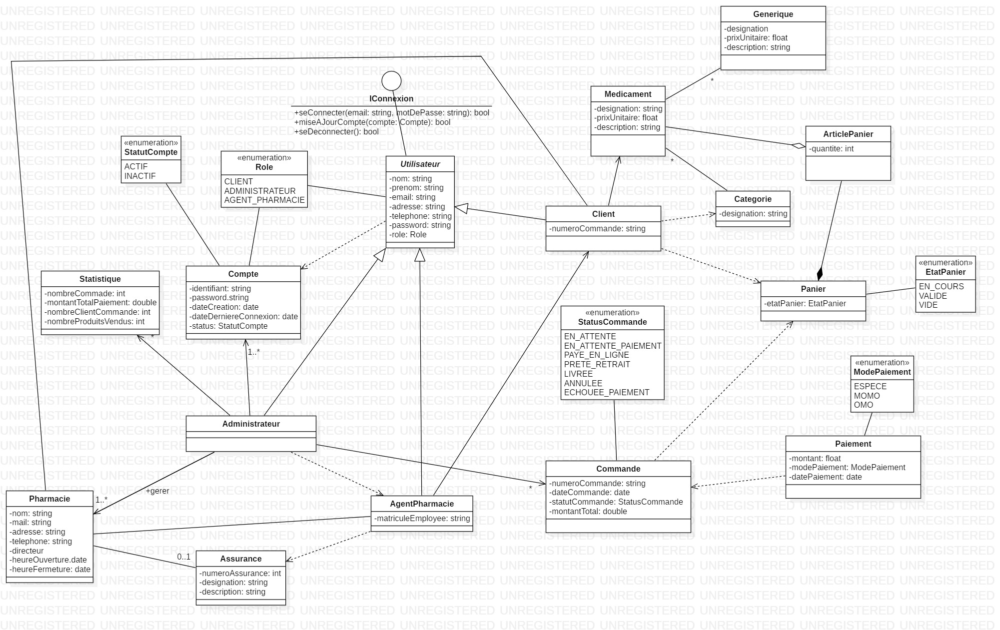
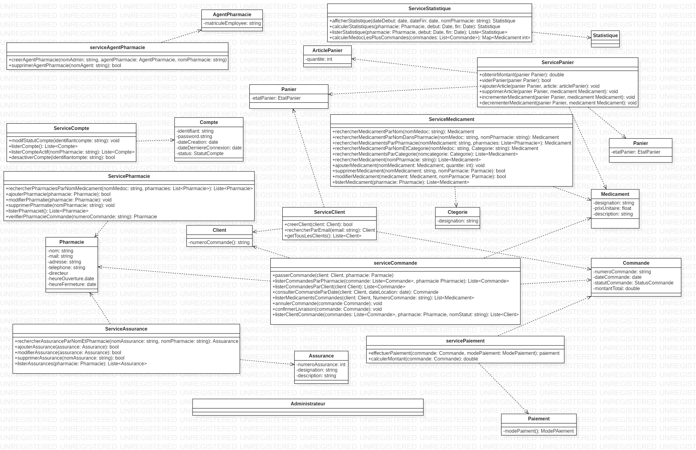

# 💊 SystPharma – Plateforme de gestion de pharmacie avec Spring Boot

**SystPharma** est une application Java orientée objet, modernisée avec **Spring Boot**, conçue pour faciliter la gestion d’une pharmacie.
Elle offre une interface console pour les **Clients**, et pose les bases pour les **Agents de pharmacie** et les **Administrateurs**, leur permettant d'interagir avec les fonctionnalités de gestion des médicaments, des commandes, etc.

---

## 🚀 Fonctionnalités Clés (Version Actuelle - Console avec Spring Boot)

### 👥 Gestion des Acteurs
- **Client** : S'enregistre, se connecte. (Recherche médicaments, panier, commandes sont des fonctionnalités en développement ou futures).
- **Agent de pharmacie** : (Fonctionnalités futures : Gère les médicaments, assurances, commandes).
- **Administrateur** : (Fonctionnalités futures : Supervise, accède aux statistiques).

### 🔐 Authentification & Compte
- Connexion / Déconnexion (logique de base implémentée).
- Création de compte client avec validations.
- Système de rôles (`Role.CLIENT`, etc.) et statut de compte (`StatutCompte.ACTIF`, etc.) via le modèle de domaine.

### 🧪 Gestion des Médicaments & Autres (Bases pour développement futur)
- L'infrastructure DAO/Service est en place pour étendre ces fonctionnalités.

---

## 🛠️ Architecture & Bonnes Pratiques

Ce projet intègre **Spring Boot** et adhère à des principes de conception robustes :

-   ✅ **Architecture multicouche** : Organisation claire en couches (`domaine`, `dao`, `service`, `presentation`).
-   ✅ **Spring Boot** : Utilisation pour la gestion des dépendances, l'auto-configuration, la gestion des beans (IoC/DI) et le serveur embarqué (si application web future).
-   ✅ **Sécurité des requêtes SQL** : Utilisation systématique de `PreparedStatement` (via la logique de `AbstractDAO`).
-   ✅ **Gestion de la connexion JDBC via Spring Boot** : Le `DataSource` est configuré par Spring Boot (`application.properties`) et injecté dans les DAOs.
-   ✅ **Configuration externalisée** : Paramètres de connexion à la base de données gérés via `application.properties` (standard Spring Boot) et potentiellement des profils Spring. L'ancien système de filtrage Maven pour `db.properties` est moins central avec Spring Boot pour la configuration du DataSource principal.
-   ✅ **Journalisation (Logging) avec SLF4J & Logback** : Configuration de logging standardisée via Spring Boot (Logback par défaut).
-   ✅ **Gestion personnalisée des exceptions** : Hiérarchie d'exceptions (`DatabaseException`, `BusinessException`).
-   ✅ **Programmation fonctionnelle Java 8+** : Utilisation de Stream API et d'Expressions Lambda.
-   ✅ **Tests Unitaires** : Implémentation de tests unitaires avec JUnit 5 et Mockito pour la couche service.
-   ✅ **Automatisation du build** : Utilisation de **Apache Maven** pour la gestion du projet.

---

## 📦 Modèle Métier (Entités Principales)

*(Cette section reste globalement la même, assurez-vous qu'elle reflète bien votre module `tp-domaine`)*
| Entité             | Attributs clés (non exhaustif) | Relations importantes (exemples) |
|--------------------|--------------------------------|-----------------------------------|
| **Client** (hérite de `Utilisateur`) | `id`, `email` (unique), `password`, `compte` (contenant `role`, `statut`) | - Passe des `Commandes`, possède un `Panier` |
| ... (autres entités) ... | ... | ... |
| **Compte** (dans `Utilisateur`) | `email` (identifiant), `password`, `role`, `statut` | - Associé à un `Utilisateur` |

---

## 📊 Diagrammes

*(Assurez-vous que les chemins sont corrects et que les images sont pertinentes pour la version actuelle)*
### 🧰 Diagramme de Cas d'Utilisation


### 📘 Diagrammes de Classes



---

## ⚙️ Technologies & Outils

-   **Langage** : Java 17
-   **Framework Principal** : Spring Boot 3.2.x
-   **Base de données** : MySQL
-   **Connectivité BD** : JDBC, Spring Boot JDBC (`DataSource`)
-   **Framework de Build** : Apache Maven
-   **Tests Unitaires** : JUnit 5, Mockito, Spring Test
-   **Conception d'Architecture** : Multicouche, Pattern DAO et Service, IoC/DI avec Spring.
-   **Configuration** : `application.properties` (Spring Boot).
-   **Journalisation** : SLF4J avec Logback (via Spring Boot).
-   **IDE** : IntelliJ IDEA
-   **Contrôle de Version** : Git / GitHub

---

## 📈 État d’Avancement du Projet

| Tâche                                      | Statut | Description                                                                  |
| :----------------------------------------- | :----- | :--------------------------------------------------------------------------- |
| Architecture en couches                    | ✅      | Maintenue et adaptée pour Spring.                                           |
| Intégration Spring Boot (Core, DI, IoC)    | ✅      | Gestion des beans DAO/Service par Spring.                                     |
| Configuration DataSource via Spring Boot   | ✅      | Connexion DB gérée via `application.properties`.                             |
| Journalisation SLF4J/Logback               | ✅      | Migration depuis Log4j 1.x.                                                  |
| Services métier (ex: ServiceClient)        | ✅      | Logique métier de base avec validations.                                    |
| DAO avec AbstractDAO et JDBC               | ✅      | Accès aux données utilisant le DataSource injecté par Spring.                |
| Gestion d’erreurs personnalisée            | ✅      | Exceptions `DatabaseException` et `BusinessException`.                      |
| Tests Unitaires (Couche Service)           | ✅      | Tests pour `ServiceClient` avec JUnit 5 & Mockito.                           |
| Interface Console (CLI) via Spring Boot    | ✅      | Point d'entrée `CommandLineRunner` fonctionnel.                              |
| Maven (Build, Dépendances)                 | ✅      | Adapté pour Spring Boot.                                                    |
| Interface Graphique ou Web                 | ⏳      | Développement futur.                                                         |

---

## 📂 Fichiers Clés du Projet

-   `pom.xml` (à la racine) : Fichier POM parent configuré pour Spring Boot.
-   `tp-presentation/src/main/java/com/sido/syspharma/presentation/SysPharmaSpringApplication.java` : Point d'entrée principal de l'application Spring Boot.
-   `tp-presentation/src/main/resources/application.properties` : Fichier de configuration principal de Spring Boot (incluant la configuration du DataSource).
-   Optionnel: `tp-presentation/src/main/resources/logback-spring.xml` : Pour une configuration avancée de Logback.
-   Anciens fichiers de configuration (pour référence ou si encore utilisés partiellement) :
    -   `tp-dao/src/main/resources/db.properties` (template)
    -   `tp-dao/src/main/resources/filters/dev.properties` (valeurs locales, **dans `.gitignore`**)

---

## 🔐 Sécurité & Bonnes Pratiques

-   **Protection contre les injections SQL** : `PreparedStatement` via `AbstractDAO`.
-   **Externalisation des configurations sensibles** : Identifiants de base de données dans `application.properties`, qui peut être géré par des profils Spring ou des variables d'environnement en production (ne pas commiter les identifiants de production).
-   **Traçabilité des anomalies** : Logging avec SLF4J/Logback.

---

### Étapes d'exécution

1.  **Prérequis :**
    *   Java JDK 17 (ou configuré dans `pom.xml`).
    *   Apache Maven.
    *   Serveur MySQL accessible.
    *   Base de données créée : `CREATE DATABASE syspharma_dev CHARACTER SET utf8mb4 COLLATE utf8mb4_unicode_ci;`
    *   (Optionnel) Les tables `client`, `medicament` etc. sont créées par l'application au démarrage via `TableCreator` si vous avez gardé cette logique appelée depuis `SysPharmaSpringApplication`.

2.  **Clonez le dépôt du projet :**
    ```bash
    git clone [URL_DU_VOTRE_DEPOT_GITHUB]
    cd SysPharmaMaven
    ```

3.  **Configurez les identifiants de la base de données :**
    *   Ouvrez le fichier `tp-presentation/src/main/resources/application.properties`.
    *   Mettez à jour les valeurs `spring.datasource.username` et `spring.datasource.password` avec vos identifiants MySQL.
        ```properties
        spring.datasource.url=jdbc:mysql://localhost:3306/syspharma_dev?useSSL=false&serverTimezone=UTC&allowPublicKeyRetrieval=true
        spring.datasource.username=votre_utilisateur_mysql
        spring.datasource.password=votre_mot_de_passe_mysql
        ```
    *   Ce fichier `application.properties` peut être adapté pour différents environnements en utilisant les profils Spring (`application-dev.properties`, `application-prod.properties`). Le fichier de base ne devrait pas contenir d'identifiants de production s'il est versionné.

4.  **Construisez le projet avec Maven :**
    À la racine du projet (`SysPharmaMaven`), exécutez :
    ```bash
    mvn clean install
    ```
    *(L'activation du profil `-Pdev` n'est plus nécessaire pour la configuration du DataSource si elle est gérée par `application.properties` directement, à moins que vous l'utilisiez pour d'autres filtrages).*

5.  **Exécutez l'application Spring Boot :**
    *   **Depuis l'IDE :** Exécutez la méthode `main` de `SysPharmaSpringApplication.java`.
    *   **Depuis la ligne de commande (après `mvn clean install`) :**
        ```bash
        java -jar tp-presentation/target/tp-presentation-1.0-SNAPSHOT.jar
        ```
        *(Vérifiez le nom exact du JAR généré dans le répertoire `tp-presentation/target/`)*

---

## 🤝 Contributions

Les contributions sont les bienvenues ! Veuillez ouvrir une `Issue` pour discuter des changements majeurs ou soumettre une `Pull Request` pour des corrections ou améliorations mineures.

---


## 👩‍💻 Auteur

Projet réalisé dans le cadre d'un TP Java chez Objis partenaire de 10000codeurs
Par Sidonie DJUISSI FOHOUO
**Période :** Février 2024 – Juin 2025
Dernière mise à jour : 06 Juin 2025

-   **LinkedIn** : [www.linkedin.com/in/sidonie-djuissi-fohouo](https://www.linkedin.com/in/sidonie-djuissi-fohouo)
-   **Email** : sidoniedjuissifohouo@gmail.com
-   **Téléphone** : +237 696 00 23 77

